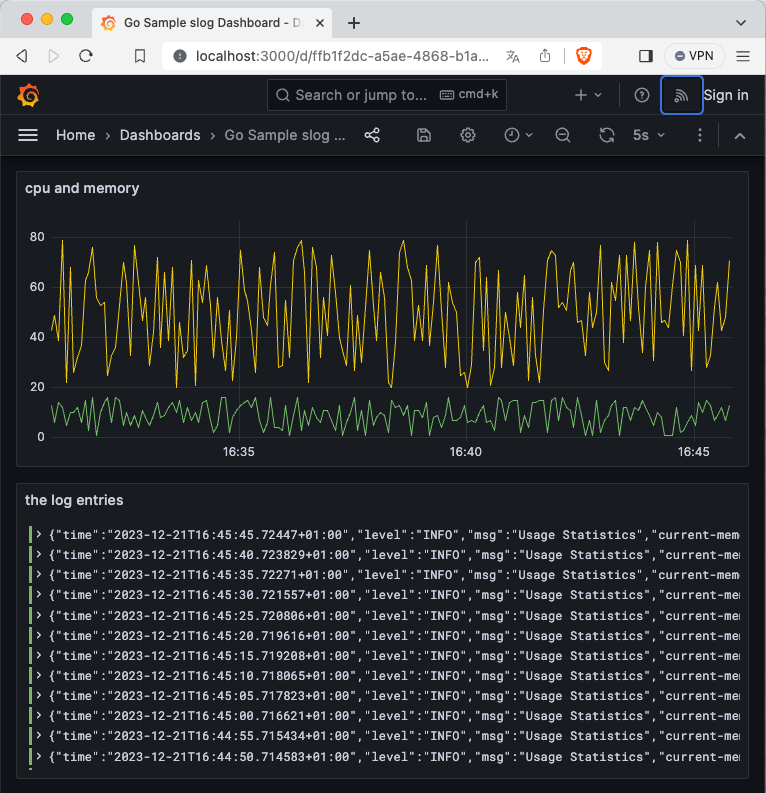

# golang-slog-grafana

> [!CAUTION]
> This is a showcase/tutorial and comes without any warranty at all!

This is a small tutorial how to create a go/golang app using slog and grafana to display the logged data/statistics.

Grafana (incl. Loki and Promtail) are running in the docker environment. The go application is started locally.

## What do we want to achieve?
- [ ] We want to have a running go app, that writes some logs.
- [ ] Within these logs will be some information with usage statistics.
- [ ] We want to display these statistics within grafana, running in a container.

## Requirements
You need to have docker and go installed.

# Tutorial

We will go step-by-step with all the magic highlighted here:

## The go application

We write a very simple and straigh-forward go-cli, that simply does nothing else than producing fake data. The `stats.go` shows all the magic:

```go
func UpdateStats(logger *slog.Logger) {
	logger.Info("Usage Statistics",
		slog.Int("current-memory", rand.Intn(60)+20),
		slog.Int("min-memory", 20),
		slog.Int("max-memory", 80),
		slog.Int("cpu", rand.Intn(16)+1),
	)
}
```

The data is therefore randomly generated and is only used for research purposes.

> [!TIP]
> We reuse the already configured logger from the main app.

- [x] Within these logs will be some information with usage statistics.

### Using slog and provide as JSON output

We create a new `slog` logger with JSON. This can be done with:
```go
logger := slog.New(slog.NewJSONHandler(os.Stderr, nil)
```

By default, the logger sends its output to `Stderr`. We would like the log output to be written to a file so that we can share it directly with Grafana.

> [!NOTE]
> **The Magic:** We open a file and configure the NewJSONHandler to use this:
```go
    f, err := os.OpenFile(LOGFILE, os.O_RDWR|os.O_CREATE|os.O_APPEND, 0666)
	if err != nil {
		log.Fatalf("error opening file: %v", err.Error())
	}
	defer f.Close()
```

And now we create as much data as we want every `UPDATE_IN_SECONDS` seconds in an infinite loop.
```go
	for {
		stats.UpdateStats(logger)
		time.Sleep((UPDATE_IN_SECONDS * time.Second))
	}
```

This log file is written to our local `logs` directory and later used by promtail to retrieve the specified statistics in it.

- [x] We want to have a running go app, that writes some logs.

## Grafana, Loki and Promtail

[Grafana](https://grafana.com/) is a great tool to display metrics and information in nice dashboards. And we want to display our randomly generated metrics in Grafana in a nice dashboard.

> [!NOTE]
> If you have never worked with Grafana before, consider Grafana as a UI, Loki as a log file indexer and Promtail as a tool for regular log file monitoring. This is a very strong simplification and the tools are of course much more powerful, but this basic understanding is sufficient for our showcase here.

### The docker setup

The tricky parts are all in the [docker setup](docker-compose.yml). We start with the most simple configuration: Loki:

#### Loki

We fetch the latest [Loki](https://grafana.com/oss/loki/) image and define the app running on port 3100. Additionally we define a network named `loki` that will be reused for Promtail and Grafana (In this respect, the name `loki` may need to be reconsidered at this point).

```yaml
...
networks:
  loki:

services:
### Loki
  loki:
    image: grafana/loki:latest
    ports:
      - "3100:3100"
    command: -config.file=/etc/loki/local-config.yaml
    networks:
      - loki
...
```

#### Promtail

[Promtail](https://grafana.com/docs/loki/latest/send-data/promtail/) has to be set up using the same network `loki` and needs to have access to out local logfile.

> [!NOTE]
> **The Magic:** We add the local directory `logs` as volume to Promtail:

```yaml
...
  promtail:
    image: grafana/promtail:latest
    volumes:
      - ./logs:/var/log
    command: -config.file=/etc/promtail/config.yml
    networks:
      - loki
...
```

#### Grafana

The [Grafana](https://grafana.com/) part is the biggest - of course. Let's start with the simple things that we already know or have already used here:

- Grafana will run on localhost, port 3000
- We use the same network `loki` here
- We would like to share the dashboards folder with Grafana in order to provide a dashboard for the data we have created. We use the `volumes` for that again:

```yaml
  grafana:
    image: grafana/grafana:latest
...
   ports:
      - "3000:3000"
    volumes:
      - ./grafana/dashboards:/var/lib/grafana/dashboards
    networks:
      - loki
```

Now comes the tricky part. We want Grafana to load our pre-defined dashboard on startup. Therefore Grafana needs to have Loki as provisioned datasource and our local dashboard folder enabled.

> [!NOTE]
> **The Magic:** We create the `yaml` files for the Grafana by echoing them in `/etc/grafana/provisioning/datasources/ds.yaml` and `/etc/grafana/provisioning/dashboards/dashboard.yaml`:

```yaml
  grafana:
    image: grafana/grafana:latest
...
entrypoint:
      - sh
      - -euc
      - |
        mkdir -p /etc/grafana/provisioning/datasources
        cat <<EOF > /etc/grafana/provisioning/datasources/ds.yaml
        apiVersion: 1
        datasources:
        - name: Loki
          type: loki
          access: proxy
          orgId: 1
          uid: P8E80F9AEF21F6940
          url: http://loki:3100
          basicAuth: false
          isDefault: true
          version: 1
          editable: false
        EOF
        mkdir -p /etc/grafana/provisioning/dashboards
        cat <<EOF > /etc/grafana/provisioning/dashboards/dashboard.yaml
        apiVersion: 1
        providers:
        - name: 'Go slog showcase'
          orgId: 1
          type: file
          disableDeletion: false
          updateIntervalSeconds: 60
          allowUiUpdates: false
          options:
            path: /var/lib/grafana/dashboards
            foldersFromFilesStructure: true
        EOF
...
```

Now Grafana is checking on startup and each 60 seconds if there is some new dashboard in our mounted directory `grafana/dashboards`. You can now easily store the Grafana Dashboard JSON in that directory.

## Now let's launch the rocket

> [!TIP]
> In visual studio code you can easily run the app using "Launch file"

First we start Go application:
```bash
bash$ cd cmd/slog
bash$ go build slog.go
bash$ ./slog & # <-- remove the & if you do not want to have the app running in the background
```

Secondly, we start Grafana, etc.:
```bash
bash$ docker-compose up # <-- start this from this projects root directory
```

After a few seconds you can access [Grafana on localhost](http://localhost:3000):


# A few more notes

> [!TIP]
> Have a look at the panel "cpu and memory" to see, how a) the data is filtered and b) how the logged data can be used for visualization.

a) We filter the data by the label `level` which represents the loglevel (in the tab **"Query"**). And secondly, we filter by the label `msg`, which has to be `Usage Statistics`. Other log information such as debug log level entries, etc. are filtered out.

b) All slog-JSON is written as strings although we used `slog.Int(...)`. Strings cannot be used and you will get the error _"Data is missing a number field"_ if you want to use this data in views other than the plain log view. **The magic** is here to map the fields to a new alias and convert the type of the alias as number (in the tab **"Transform data"**). So you have the original data to be displayed in the log view and the mapped data to be displayed in the graph view.
